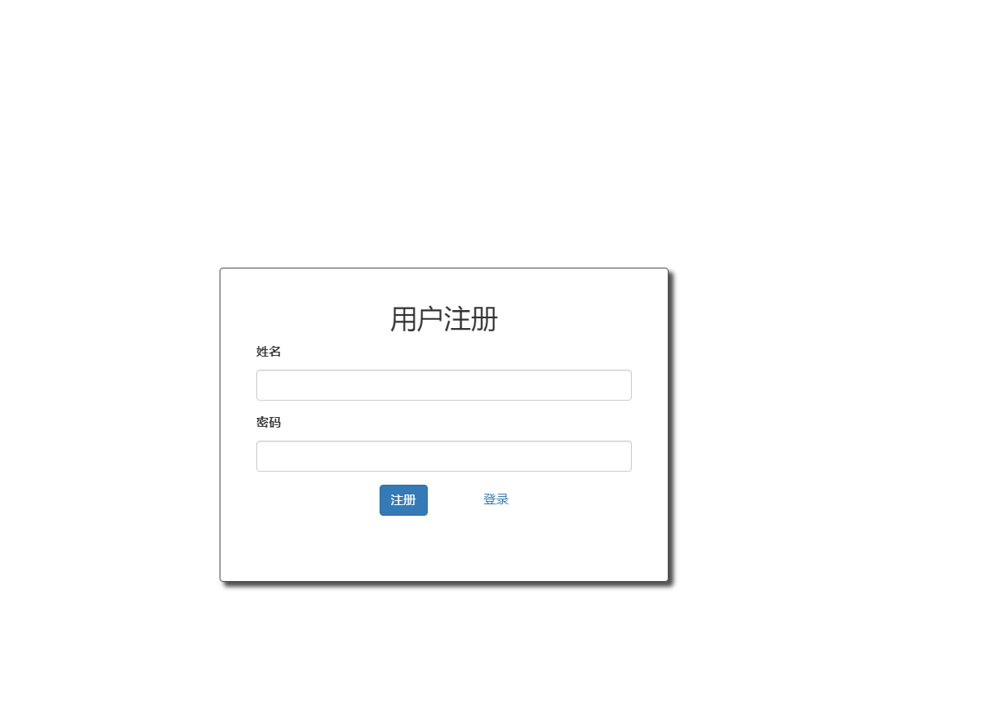
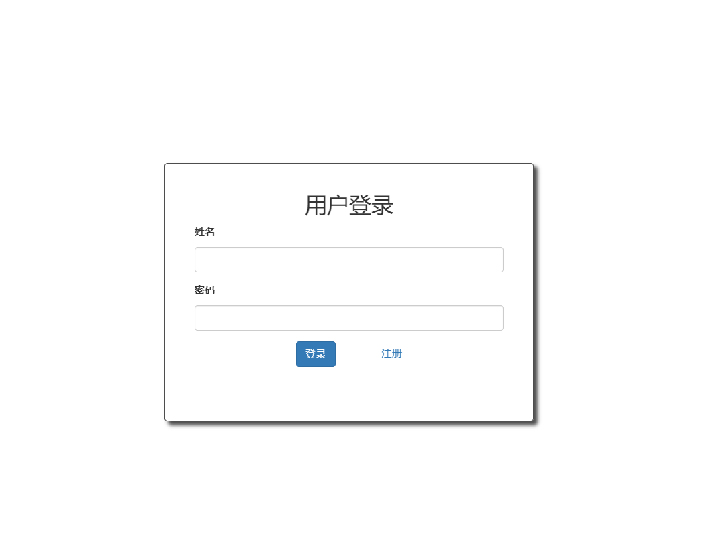

# note_flask
## 1. 功能简介

开发一个功能完整的 Web 应用程序 —— 待做清单

该 Web 应用程序记录待做事项。程序提供了用户注册的功能，用户登录后，录入的待做事项被记录在服务端

如果换一台机器，使用浏览器登录后，仍然能够看到已经录入的待做事项。

## 2. 涉及的知识点

本节开发的待做清单程序，在保持程序简短时，尽可能融入了更多的知识点，包括：

- 模板
- WTF 表单和表单验证
- 蓝图
- ORM 访问数据库
- 会话 Session

## 3. 运行程序

程序由多个源文件构成，如下所示：

| 源文件                       | 描述                                                     |
| :--------------------------- | :------------------------------------------------------- |
| db.sql                       | 创建数据库的 SQL 脚本文件                                |
| [app.py](http://app.py/)     | Flask 应用程序实例以及配置                               |
| [main.py](http://main.py/)   | Flask 应用程序的入口                                     |
| [db.py](http://db.py/)       | 提供访问数据库的功能函数                                 |
| [users.py](http://users.py/) | 实现蓝图 users，提供登录、注册的功能                     |
| [todos.py](http://todos.py/) | 实现蓝图 todos，提供增加、修改、删除待做事项 todo 的功能 |
| templates/index.html         | 首页的页面模板                                           |
| templates/login.html         | 登录的页面模板                                           |
| templates/register.html      | 注册的页面模板                                           |
| static/style.css             | 样式文件                                                 |
| static/script.js             | 调用后端服务的接口                                       |

### 安装相关的库

为了使用 Flask 框架、数据库 ORM、表单验证等模块，使用 pip3 依次安装：

```python
pip3 install flask
pip3 install pymysql
pip3 install SQLAlchemy
pip3 install flask-sqlalchemy
pip3 install wtforms
pip3 install flask-wtf

```

### 设置数据库

例子使用 mysql 数据库，用户名为 root，密码为 ‘123456’，可以在 [db.py](http://db.py/) 中修改用户名和密码。

启动 mysql 后，执行数据库脚本 db.sql 创建数据库 todoDB:

```mysql
mysql> source db.sql

```

### 运行程序

[main.py](http://main.py/) 是程序的入口，执行如下命令启动程序：

```python
$ python3 main.py

```

注册界面




登录界面




## 4. 程序的结构

  

程序的核心结构如上图所示，程序由前端与后端构成。

前端的核心操作如下：

- 在 login.html 中，通过 POST 方法向页面 /users/login 提交表单请求完成登录；
- 在 register.html 中，通过 POST 方法向页面 /users/register 提交表单请求完成登录；
- 访问页面 /users/logout 退出系统；
- 在 script.js 中，函数 addTodo () 通过 Ajax 向页面 /todos/add 请求增加待做事项；
- 在 script.js 中，函数 updateTodo () 通过 Ajax 向页面 /todos/update 请求更新待做事项；
- 在 script.js 中，函数 deleteTodo () 通过 Ajax 向页面 /todos/delete 请求删除待做事项。

后端的核心操作如下：

- Flask 程序使用了 2 个蓝图：users 和 todos；
- 蓝图 users 定义了页面 /users/login 、/users/register、/users/logout，登录和注册的页面处理函数是 login 和 register，最终调用 db.js 中的数据库访问函数 login 和 register，实现登录和注册的功能；
- 蓝图 todos 定义了页面 /todos/add、/todos/update、/todos/delete，它们的页面处理函数是 addTodo、updateTodo、deleteTodo，最终调用 db.js 中的数据库访问函数 addTodo、updateTodo、deleteTodo，实现增加、更新、删除待做事项的功能。

## 5. 小结

本小节介绍了待做清单的功能和程序结构，使用思维导图描述如下：

  


  

  

